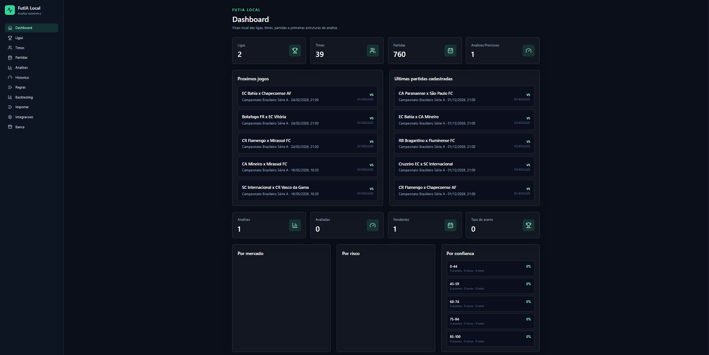
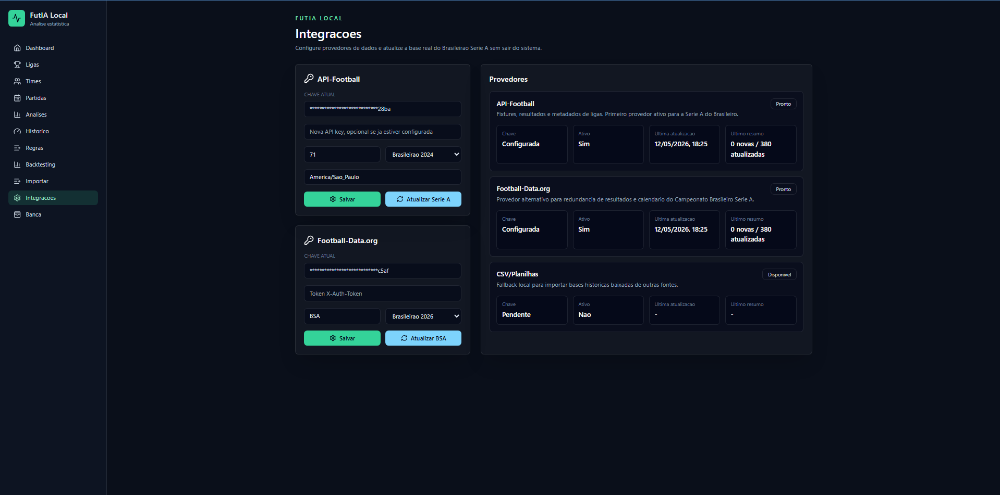
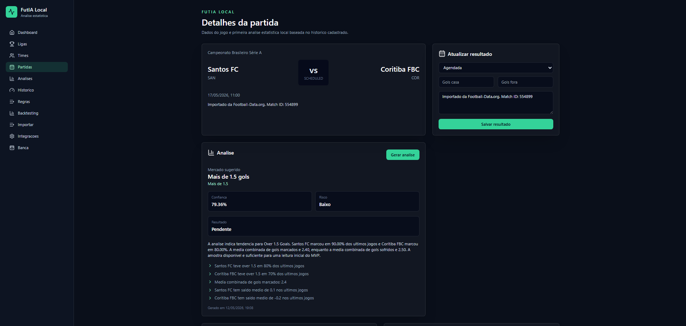
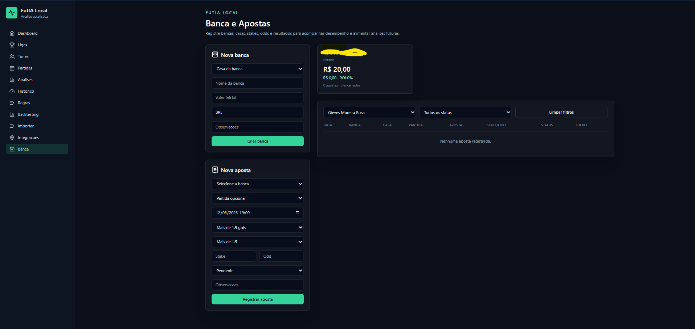

# FutIA Local

FutIA Local is a local-first football analysis and bankroll tracking app focused on Brazilian football workflows.

It combines real fixture imports, statistical match analysis, configurable betting-market rules, backtesting and a bankroll journal for bets placed by the user.



## Status

```text
Version: 0.1.0
Stage: local MVP
Primary focus: Campeonato Brasileiro Serie A
```

## Main Features

- Local Laravel 11 API and React 18 frontend.
- SQLite database for private/local use.
- Real match imports through:
  - API-Football
  - Football-Data.org
  - CSV/JSON local import
- Statistical analysis engine with:
  - team form
  - home/away splits
  - goals rates
  - confidence
  - risk level
  - suggested markets
- Suggested betting markets:
  - Mais de 1.5 gols
  - Mais de 2.5 gols
  - Ambas marcam
  - Dupla chance mandante
  - Dupla chance visitante
  - Vitoria mandante
  - Vitoria visitante
- Analysis history and performance tracking.
- Backtesting without polluting persisted analysis history.
- Configurable analysis rules.
- Bankroll and bet journal with bookmaker-linked bankrolls, odds, stake, status, profit and ROI.
- GitHub-ready versioning, changelog, release notes and CI.

## Screens

| Dashboard | Integrations |
| --- | --- |
|  |  |

| Match Analysis | Bankroll |
| --- | --- |
|  |  |

See the full gallery in [docs/SCREENSHOTS.md](docs/SCREENSHOTS.md).

## Tech Stack

- PHP 8.2+
- Laravel 11
- React 18
- TypeScript
- Vite
- Tailwind CSS
- SQLite
- TanStack Query
- Axios
- Lucide React

## Quick Start

Install dependencies:

```bash
composer install
npm install
```

Create `.env`:

```bash
cp .env.example .env
php artisan key:generate
```

On Windows PowerShell:

```powershell
Copy-Item .env.example .env
php artisan key:generate
```

Create and migrate SQLite:

```bash
php -r "file_exists('database/database.sqlite') || touch('database/database.sqlite');"
php artisan migrate
```

Start the backend:

```bash
php artisan serve
```

Start the frontend:

```bash
npm run dev
```

Open:

```text
http://127.0.0.1:8000
```

Full setup instructions: [docs/SETUP.md](docs/SETUP.md).

## Provider Configuration

API keys can be configured through the `/integrations` page.

Optional `.env` keys:

```env
API_FOOTBALL_KEY=
API_FOOTBALL_BASE_URL=https://v3.football.api-sports.io
FOOTBALL_DATA_ORG_KEY=
FOOTBALL_DATA_ORG_BASE_URL=https://api.football-data.org/v4
```

Default Brazilian Serie A provider settings:

```text
API-Football: league=71
Football-Data.org: competition=BSA
```

More details: [docs/INTEGRATIONS.md](docs/INTEGRATIONS.md).

## Data Safety

This repository intentionally ignores:

- `.env`
- local SQLite databases
- logs
- vendor dependencies
- node dependencies

Provider keys entered through the UI are encrypted in the local database. Do not commit local database files.

Security notes: [docs/SECURITY.md](docs/SECURITY.md).

## Validation

```bash
php artisan test
npm run typecheck
npm run build
```

## Documentation

- [Setup](docs/SETUP.md)
- [Architecture](docs/ARCHITECTURE.md)
- [API Reference](docs/API.md)
- [Integrations](docs/INTEGRATIONS.md)
- [Security](docs/SECURITY.md)
- [Versioning](docs/VERSIONING.md)
- [Roadmap](docs/ROADMAP.md)
- [Screenshots](docs/SCREENSHOTS.md)
- [Changelog](CHANGELOG.md)
- [Release v0.1.0](docs/releases/v0.1.0.md)
- [Contributing](CONTRIBUTING.md)

## Versioning

The project follows Semantic Versioning.

Current version:

```text
0.1.0
```

See [VERSION](VERSION), [CHANGELOG.md](CHANGELOG.md) and [docs/VERSIONING.md](docs/VERSIONING.md).

## Responsible Use

FutIA Local is an analytical and tracking tool. It does not guarantee betting outcomes and should not be treated as financial advice.
